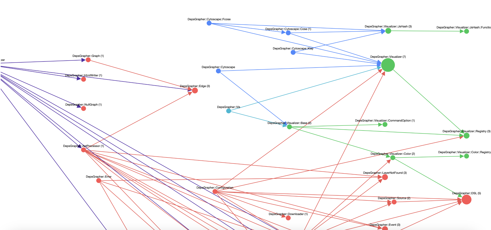
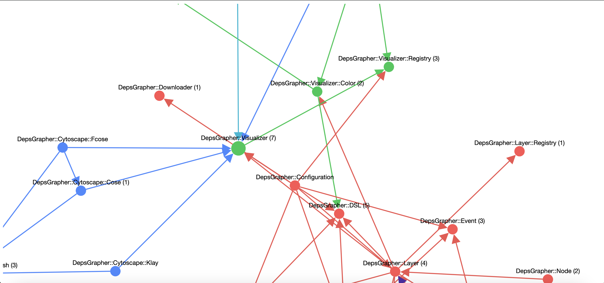
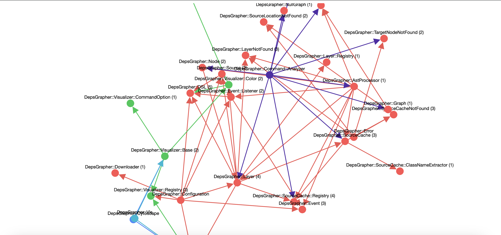
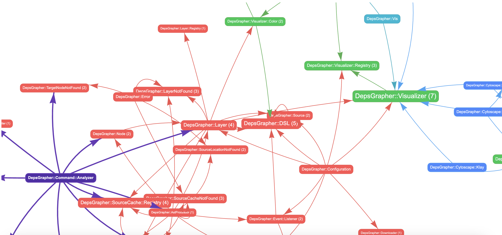
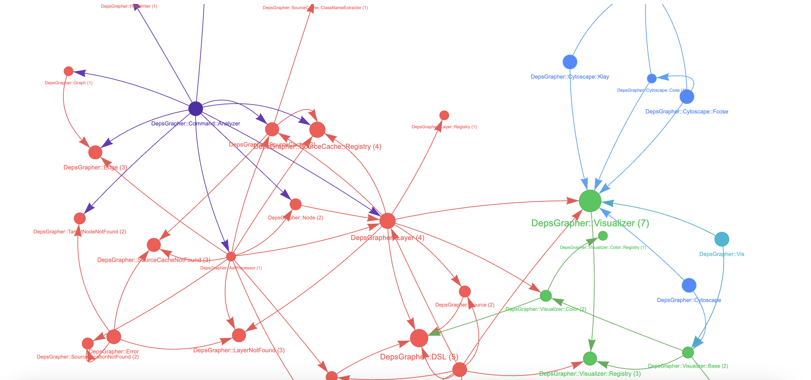

Deps Grapher
====

A Tool to visualize Ruby class dependencies

## Description

Deps Grapher is intended for a general understanding of class dependencies through static analysis. It uses `parser` gem.

Please note the following:

- Information determined at runtime cannot be analyzed
- Dependencies of classes and methods that are likely to change dynamically cannot be analyzed
- Method arguments that are variables cannot be analyzed

Therefore, it may not be accurate and should be used as a reference only.

## Installation

Please add this line to your application's Gemfile:

```ruby
gem "deps_grapher"
```

And then run the following command:

```shell
bundle install
```

## Usage

### Generate a configuration file

```shell
cd ${your directory}
bundle exec deps_grapher init
```

The following message will be displayed.

```shell
`${your directory}/graphile.rb` was created.
Please edit the configuration file.
Run `bundle exec deps_grapher -c graphile.rb`.
```

Please try to run the following command.

```shell
bundle exec deps_grapher -c graphile.rb
```

The visualized graph will be output to the tmp directory.

Please open the index.html in the graph directory with your browser.

> ${your directory}/tmp/deps_grapher/graph/index.html

### Customize the configuration file for your project

DSL is used to define the configuration file.

The DSL provides the following methods.

- `output_dir` - Specify the output directory where the graph html is output
- `cache_dir` - Specify the cache directory where the analysis result is stored
- `plugin_dir` - Specify the plugin directory. Plugins allow you to use customized visualizations and will be loaded by `Configuration#load_plugin!` method.
- `visualizer` - Specify the default graph type (default: "cy:klay")
- `ast_processor_policy` - Specify the policy for processing the AST
  - `include_const` - Specify the constant or regular expression to be included in the analysis
  - `exclude_const` - Specify the constant or regular expression to be excluded from the analysis
  - `include_location` - Specify the location or regular expression to be included in the analysis
  - `exclude_location` - Specify the location or regular expression to be excluded from the analysis
  - `advanced_const_resolver` - Specify the object that has `call` method to resolve the constant. You can write a custom logic to resolve the constant using ast_node of parser gem. The block should return a string of const name or nil. If return nil, the const name will be resolved by default logic.
- `layer` - Specify the layer to be displayed in the graph
  - `name` - Specify the layer name (required)
  - `visible` - Specify whether the layer is visible (default: true)
  - `source` - Specify the source directory of the layer (required)
    - `root` - Specify the root directory of the layer (required)
    - `include_pattern` - Specify the pattern to include in the analysis (default: nil)
    - `exclude_pattern` - Specify the pattern to exclude from the analysis (default: nil)
    - `glob_pattern` - Specify the glob pattern to include in the analysis (default: ["**/*.rb"])
  - `color` - Specify the color of the layer (required)
    - `background` - Specify the background color of the node and the edge (required)
    - `arrow` - Specify the arrow color of the edge (default: same as `background`)
    - `border` - Specify the border color of the node and the edge (required)
    - `font` - Specify the font color of the the node and the edge (required)
- `with_plugin` - Specify the extension plugin directory. Plugins allow you to use customized visualizations.

### Configuration example

```ruby
# frozen_string_literal: true

# directory settings
# customize for your project
output_dir File.expand_path "tmp/deps_grapher/graph"
cache_dir File.expand_path "tmp/deps_grapher/cache"

root_dir = "<%= root_dir %>"
lib_root_dir = File.join(root_dir, "lib")
layer_root_dir = File.join(lib_root_dir, "deps_grapher")

# default visualizer setting
visualizer "<%= visualizer %>"

ast_processor_policy do
  exclude_const /\ADepsGrapher\z/

  # advanced_const_resolver do |ast_node|
  #   # some advanced logic using ast_node of parser gem
  #   # this block should return a string of const name or nil
  #   # if return nil, the const name will be resolved by default logic
  # end
end

layer do
  name :deps_grapher
  visible true

  source do
    root lib_root_dir
    exclude_pattern %r{/(command|cytoscape|vis|visualizer)}
  end

  color do
    background "#FF5252"
    border "#EF5350"
    font "#FF5252"
  end
end

layer do
  name :command
  visible true

  source do
    root File.join(layer_root_dir, "command")
  end

  color do
    background "#512DA8"
    border "#673AB7"
    font "#512DA8"
  end
end

layer do
  name :cytoscape
  visible true

  source do
    root layer_root_dir
    glob_pattern ["cytoscape.rb", "cytoscape/**/*.rb"]
  end

  color do
    background "#448AFF"
    border "#42A5F5"
    font "#448AFF"
  end
end

layer do
  name :vis
  visible true

  source do
    root layer_root_dir
    glob_pattern ["vis.rb", "vis/**/*.rb"]
  end

  color do
    background "#00B8D4"
    border "#00ACC1"
    font "#00B8D4"
  end
end

layer do
  name :visualizer
  visible true

  source do
    root layer_root_dir
    glob_pattern ["visualizer.rb", "visualizer/**/*.rb"]
  end

  color do
    background "#00C853"
    border "#4CAF50"
    font "#00C853"
  end
end

with_plugin do |plugin_dir|
  layer do
    name :plugin
    visible true

    source do
      root plugin_dir
    end

    color do
      background "#607D8B"
      border "#78909C"
      font "#607D8B"
    end
  end
end
```


### Run deps_grapher

```shell
cd ${your directory}
bundle exec deps_grapher -c graphile.rb [options]
```

If `-c` is omitted, will find the configuration file `./graphile.rb` from the current directory and use it if found 

```shell
bundle exec deps_grapher --source "*Controller"  --target "*Service"
```

#### Command line options

| Option                | Short Form  | Description                                                                                                   |
|-----------------------|-------------|---------------------------------------------------------------------------------------------------------------|
| `--config CONFIG`     | `-c CONFIG` | Specify the path to the configuration file                                                                    |
| `--dump`              |             | Dump the configuration                                                                                        |
| `--root ROOT_DIR`     |             | Specify a directory path you want to check without configuration                                              |
| `--graph GRAPH`       | `-g GRAPH`  | Specify the type of graph                                                                                     |
| `--layer LAYER`       |             | Specify the visible layer name (comma-separated is okay, also "all" means that displays all layers)           |
| `--source CLASS_NAME` |             | Specify the source class on the graph (wildcards can be used, also `--target` is required if use this option) |
| `--target CLASS_NAME` |             | Specify the target class on the graph (wildcards can be used)                                                 |
| `--clean`             |             | Clear the cache and output directory                                                                          |
| `--ignore-errors`     |             | Ignore errors                                                                                                 |
| `--verbose`           |             | Display verbose log                                                                                           |


#### Without the configuration file

The `root` option allows you to run it without configuration.

```shell
bundle exec deps_grapher --root ${your directory} --source "*Controller"  --target "*Service"
```

This is generating a temporary configuration file internally.

### Visualize the graph

#### cy:klay (default)


```shell
bundle exec deps_grapher -g cy:klay
```



#### cy:cose

```shell
bundle exec deps_grapher -g cy:cose
```



#### cy:fcose

```shell
bundle exec deps_grapher -g cy:fcose
```



#### vis:box

```shell
bundle exec deps_grapher -g vis:box
```



#### vis:dot

```shell
bundle exec deps_grapher -g vis:dot
```



### Specify the layer to be displayed in the graph

```shell
bundle exec deps_grapher --layer your_layer,another_layer...
```

If no layer is specified, layers with "visible" set to "true" will be displayed.

Also if you want to display all layers, specify as follows.

```shell
bundle exec deps_grapher --layer all --source "*Controller" --target "*Service"
```

However, be careful as having too many dependencies can greatly reduce readability and performance.

It is recommended to use both the `source` and `target` options.

## License
[The MIT License](./LICENSE.txt)

## Acknowledgement

This tool is using the following open-source software.

- cytoscape.js (https://github.com/cytoscape/cytoscape.js) - Licensed under MIT License (https://opensource.org/licenses/MIT)
- vis-network (https://github.com/visjs/vis-network) - Licensed under Apache License 2.0 (https://www.apache.org/licenses/LICENSE-2.0) and MIT License (https://opensource.org/licenses/MIT)

We thank the contributors of these software for their great work.
